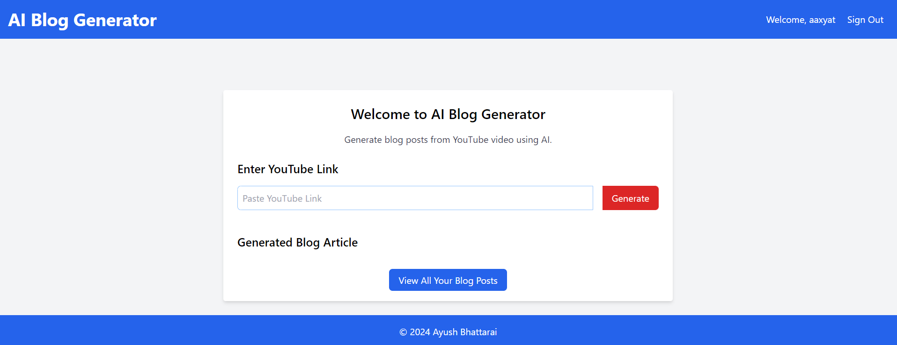

# AI Blog App 🚀

Welcome to AI Blog App, a Django-based web application that leverages the power of AI to generate blog content from YouTube videos. This project uses PostgreSQL as its database and integrates with AssemblyAI and OpenAI APIs for AI functionalities.

## Screenshot 📸



## Getting Started 🏁

These instructions will get you a copy of the project up and running on your local machine for development and testing purposes.

### Prerequisites 📋

- Python 3.8+
- PostgreSQL
- AssemblyAI API Key
- OpenAI API Key

### Installation 🔧

1. Clone the repository:

```sh
git clone https://github.com/aaxyat/AI-Blog-App.git
```

2. Navigate to the project directory:

```sh
cd AI-Blog-App
```

3. Install the required Python packages:

```sh
pip install -r requirements.txt
```

4. Copy the `.env.example` file and rename it to `.env`. Fill in the environment variables:

```sh
cp .env.example .env
```

5. Run the Django migrations:

```sh
python manage.py migrate
```

6. Start the Django server:

```sh
python manage.py runserver
```

The application should now be running at `http://localhost:8000`.

## Features 🌟

- User registration and authentication
- Blog post creation
- AI-powered blog content generation from YouTube videos
- Media file handling

## License 📄

This project is licensed under the GNU General Public License v3.0 - see the LICENSE file for details.

## Acknowledgments 🙏

- [Django](https://www.djangoproject.com/)
- [AssemblyAI](https://www.assemblyai.com/)
- [OpenAI](https://www.openai.com/)

Happy Coding! 💻